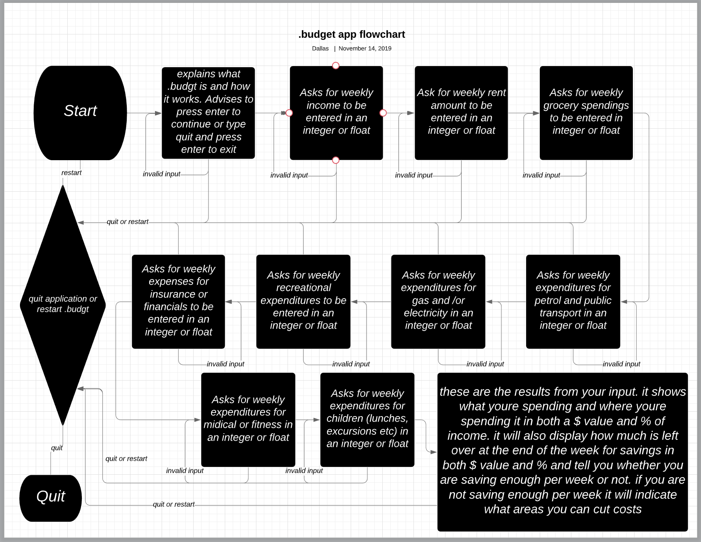

# budgt Application Development Plan

## Statement of Purpose and Scope

Budgeting is the process of creating a plan to spend your money. This spending plan is called a budget. Creating this spending plan allows you to determine in advance whether you will have enough money to do the things you need to do, as well as the things you would like to do. Budgeting is simply balancing your expenses with your income. .budgt will help users to complete this task.

Through the use of user input, .budgt will give the user a break down of where their money is being spent and on what, in a dollar value as well as percentage of income.

This application will target people of all ages. It will help high school students learn about budgeting, it will help a grandmother on the pension to put money away for christmas presents and it will help busy parents stay on top of their finances while running a crazy household, just to name a few.

## Features

- ### User Input

    A feature that makes an appearance early in the piece and continues to be used throughout the application is user input. User input is vital to the application as it relies on denominations being entered by the user to achieve the final result of the value of savings at the end of the application. User input is achieved by using a ‘puts” statement asking for certain integer or float values, followed by a “user_input = gets.chomp.to_f”, which interprets the users input not only a number, but a number capable of using decimal points.

- ### Savings as a percentage and dollar value of income after tax

    Another feature of the application is that it will return the amount you are saving in the format of a percentage and dollar value. Because it's one thing to know how much you are saving each week, but it's another to be able to grasp exactly how much of your total income the figure is. It was quite easy to achieve the percentage. It was simply a matter of dividing the remaining amount of income after deductions and multiplying by 100. There was a small hiccup where, depending on the values input it would return a number that had far greater decimal places than necessary. This was resolved by using “.truncate(2)” on the end of my formula. It essentially forced the percentage figure to only show up to 2 decimal places. 

    Working in conjunction with this feature will be a Terminal Component called TTY-Pie which will show a pie chart breaking down expenditures for the user to see. Thus should give the user better understand their financial breakdown from a visual perspective.

- ### 50/20/30 Budget Rule

    The 50/20/30 Budget Rule takes your income after tax and breaks into 3 simple sections. 50% needs, 20% Savings, 30% wants.

    Needs include things that are essential to survival and must be paid. Such as, rent or mortgage payments, car payments or Go card fees, groceries, insurance, health care and utilities (gas, electricity, phone and internet).

    Wants include things that are not necessary for survival, such as going  out for dinner or to the movies, new clothing, tickets to sporting events, vacations, the latest electronics gadget and subscriptions (Netflix, Stan, Amazon Prime, Spotify).

    Savings are fairly self explanatory, It's the money you put away for a rainy day. Savings can include the money you put into a high interest savings account or can even include money you are putting into the stock market. It is recommended that you have at least 3 months of savings on hand in case of emergency, such as losing your job or other unforeseen expenditures.

    The way that I implemented this into the application was an if/elsif/else statement. So if the output was exactly 20% it would advise the user that they are on track with their savings. If the output was more than 20% it would congratulate the user for exceeding the recommended 20% savings, if the output was more than 0%, but less than 20% it would advise the user that they should be saving more and then go on to explain the 50/20/30 budget rule so that they can re-evaluate their budget and if the output was 0% or less it would advise the player that they are aren't saving anything and potentially spending more than they earn, it then goes on to explain the 50/20/30 budget rule so that they can re-evaluate their budget.

    The application uses an Until loop that continues until the user chooses to quit. This allows the user to try again with different figures in order to better their budget.

## User Interaction and Experience

The user is prompted to enter data throughout their use of the application. The application takes the data and subtracts debtors from creditors to calculate the remaining value. Subject to this value, the user will be given one of four results to advise them on their finances.

The user is made aware of what kind of input the application is expecting as to avoid unexpected input and incorrect outcomes. If the user is to input the incorrect data type such as alphanumeric instead of just numeric, there will be an error message that prompts the user to enter the correct data type.

The user interaction with the available features vary depending on input. All users will have access to both the User Input feature as well as the Savings % feature. The user must use the User input feature to interact with the feature and all four of the available outcomes will advise the user on the dollar value and percentage of savings they are achieving. The one feature not available to everyone is the 50/20/30 rule information. This feature is only applicable to two out of the four of the available outcomes, as it is not necessarily a feature that all users need to partake in.

## Control Flow Diagram
 

## Implementation Plan

The following is a list of goals I wanted to achieve throughout the development of my application. Some of them I managed to achieve and some I ran out of time.

- create user input asking for income value (2 hours) &#x2611;
- create user input asking for multiple values to be deducted from income value (2 hours) &#x2611;
- subtract expenditures from income value and return to the user as a savings value (2 hours) &#x2611;
- return the savings value as a percentage of user input for income (3 hours) &#x2611;
- Implement Classes and Modules (3 hours) &#x2612;
- create if statement for savings value to confirm whether it is less than, equal to or greater than 20% of the income value (1 hour) &#x2611;
- Building on if statement - create unique responses to return to user for every 10% increment available. (1 hour) - EDIT Decided to only do 4 if/else statements. 10 was overkill. &#x2611;
- Decide on some Gems to add (30 mins) &#x2611;
- add gem colorize (15 mins) &#x2611;
- add gem TTY:font (1 hours) &#x2611;
- add gem TTY:pie (3 hours) &#x2612;
- add a second user input (2 hours) &#x2612;

The following is some screen shots of my Trello board progression throughout development of my application. 

*board 1*

*board 2*

*board 3*

*board 4*

*board 5*

*board 6*

*board 7*

*board 8*

*board 9*

*board 10*

*board 11*

*board 12*

*board 13*

# Test Application

| Tests | Expected Result | Actual Result |
| ------------- |:-------------:| -----:|
| Application Loop unless quit | quit at any time upon quit | quit only works at the beginning or end of application run, if quit is attempted midway through application the string is converted into a value of zero and just continues to run the application |
| Expecting an Integer or float from User input for Values| user input that isn't an integer or float will be accepted as a zero | all values that aren't integers or floats are converted to zero except the value for income which cannot be a zero as all other values rely on income to to have a value larger than zero. The end result is NaN (Not a Number) if a string is entered as income value |
| If 0% savings or less | advise user of the 0% savings or less if statement | it works, advises user of the 0% savings if statement outcome |
| If more than 0% savings, but less than 20% savings | advise user of the more than 0% savings, but less than 20% savings if statement | it works, advises user of the more than 0% savings, but less than 20% savings if statement outcome |
| If equal to 20% savings | advise user of the equal to 20% savings if statement | it works, advises user of the equal to 20% savings if statement outcome |
| If more than 20% savings | advise user of the more than 20% savings if statement |it works, advises user of the more than 20% savings if statement outcome  |