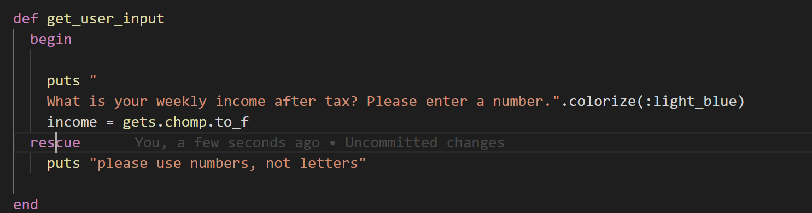

# Status Update

## Status Update 1.

I could not get TTY-Pie to integrate with my application. I managed to download the Terminal plug-in and get it to work on another ruby project, but was unable to get it working in my application. After playing with it in the previous ruby project for about an hour I worked out how I should be able to use it, but once it was moved into the application I couldn't get the values from my application to work in conjunction with the array in the pie chart. It was actually ignoring my data all together and using data that was previously used as an example in the gem. I eventually decided I was wasting too much time on it and moved away from using it at all. I am disappointed that It wont be apart of my final application, but the more I played with it, the more I realized how inaccurate the pie chart results were anyway.

---

*screenshot above: how pie chart was supposed to work*

---

## Status update 2.

I wasn't able to implement error handling into my application. My rescues never picked up on the errors I was creating in the manual testing phase. I ended up removing the begin, rescue, end because it was just cluttering up my code more and not doing anything positive for it.

*screenshot above: one of multiple attempts to get rescue to work*